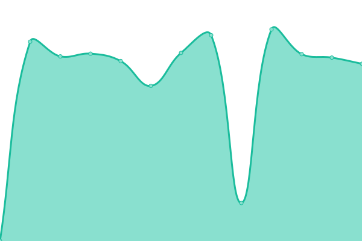
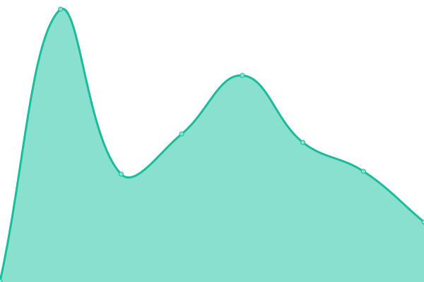

# [📈 Live Status](https://espressotutorials.github.io/et-status): <!--live status--> **🟧 Partial outage**

This repository contains the open-source uptime monitor and status page for [Espresso Tutorials](https://espresso-tutorials.de), powered by [Upptime](https://github.com/upptime/upptime).

With [Upptime](https://upptime.js.org), you can get your own unlimited and free uptime monitor and status page, powered entirely by a GitHub repository. We use [Issues](https://github.com/espressotutorials/et-status/issues) as incident reports, [Actions](https://github.com/espressotutorials/et-status/actions) as uptime monitors, and [Pages](https://espressotutorials.github.io/et-status) for the status page.

<!--start: status pages-->
<!-- This summary is generated by Upptime (https://github.com/upptime/upptime) -->
<!-- Do not edit this manually, your changes will be overwritten -->
<!-- prettier-ignore -->
| URL | Status | History | Response Time | Uptime |
| --- | ------ | ------- | ------------- | ------ |
|  [Espresso Tutorials (DE)](https://www.espresso-tutorials.de) | 🟩 Up | [espresso-tutorials-de.yml](https://github.com/espressotutorials/et-status/commits/HEAD/history/espresso-tutorials-de.yml) | 

 2323ms
     
 | 

<a href="https://espressotutorials.github.io/et-status/history/espresso-tutorials-de">100.00%</a>
    

|  [Espresso Tutorials (EN)](https://www.espresso-tutorials.com) | 🟩 Up | [espresso-tutorials-en.yml](https://github.com/espressotutorials/et-status/commits/HEAD/history/espresso-tutorials-en.yml) | 

 2079ms
     
 | 

<a href="https://espressotutorials.github.io/et-status/history/espresso-tutorials-en">100.00%</a>
    

|  [Espresso Tutorials (FR)](https://www.espresso-tutorials.fr) | 🟩 Up | [espresso-tutorials-fr.yml](https://github.com/espressotutorials/et-status/commits/HEAD/history/espresso-tutorials-fr.yml) | 

 2150ms
     
 | 

<a href="https://espressotutorials.github.io/et-status/history/espresso-tutorials-fr">100.00%</a>
    

|  [Library (Production)](https://et.training) | 🟩 Up | [library-production.yml](https://github.com/espressotutorials/et-status/commits/HEAD/history/library-production.yml) | 

 595ms
     
 | 

<a href="https://espressotutorials.github.io/et-status/history/library-production">100.00%</a>
    

|  [PLM (Production)](https://et-plm.de) | 🟩 Up | [plm-production.yml](https://github.com/espressotutorials/et-status/commits/HEAD/history/plm-production.yml) | 

 621ms
     
 | 

<a href="https://espressotutorials.github.io/et-status/history/plm-production">100.00%</a>
    

|  [ARM (Production)](https://et-arm.de) | 🟩 Up | [arm-production.yml](https://github.com/espressotutorials/et-status/commits/HEAD/history/arm-production.yml) | 

 562ms
     
 | 

<a href="https://espressotutorials.github.io/et-status/history/arm-production">100.00%</a>
    

|  [Customer Center (Production)](https://et-customer.de) | 🟩 Up | [customer-center-production.yml](https://github.com/espressotutorials/et-status/commits/HEAD/history/customer-center-production.yml) | 

 542ms
     
 | 

<a href="https://espressotutorials.github.io/et-status/history/customer-center-production">100.00%</a>
    

|  [Admin (Production)](admin.espresso-tutorials.com) | 🟩 Up | [admin-production.yml](https://github.com/espressotutorials/et-status/commits/HEAD/history/admin-production.yml) | 

 209ms
     
 | 

<a href="https://espressotutorials.github.io/et-status/history/admin-production">100.00%</a>
    

|  [Admin (Staging)](staging.admin.espresso-tutorials.com) | 🟩 Up | [admin-staging.yml](https://github.com/espressotutorials/et-status/commits/HEAD/history/admin-staging.yml) | 

 142ms
     
 | 

<a href="https://espressotutorials.github.io/et-status/history/admin-staging">100.00%</a>
    

|  [API (Staging)](staging.api.espresso-tutorials.com) | 🟥 Down | [api-staging.yml](https://github.com/espressotutorials/et-status/commits/HEAD/history/api-staging.yml) | 

 463ms
     
 | 

<a href="https://espressotutorials.github.io/et-status/history/api-staging">100.00%</a>
    

|  [Infoday (Staging)](staging.infoday.io) | 🟩 Up | [infoday-staging.yml](https://github.com/espressotutorials/et-status/commits/HEAD/history/infoday-staging.yml) | 

 185ms
     
 | 

<a href="https://espressotutorials.github.io/et-status/history/infoday-staging">100.00%</a>
    

<!--end: status pages-->

[**Visit our status website →**](https://espressotutorials.github.io/et-status)

## 📄 License

- Code: [MIT](./LICENSE) © [Espresso Tutorials](https://espresso-tutorials.de)
- Data in the `./history` directory: [Open Database License](https://opendatacommons.org/licenses/odbl/1-0/)
