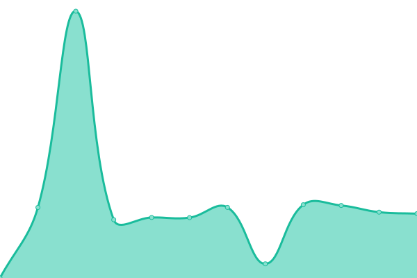

# [📈 Live Status](https://espressotutorials.github.io/et-status): <!--live status--> **🟩 All systems operational**

This repository contains the open-source uptime monitor and status page for [Espresso Tutorials](https://espresso-tutorials.de), powered by [Upptime](https://github.com/upptime/upptime).

With [Upptime](https://upptime.js.org), you can get your own unlimited and free uptime monitor and status page, powered entirely by a GitHub repository. We use [Issues](https://github.com/espressotutorials/et-status/issues) as incident reports, [Actions](https://github.com/espressotutorials/et-status/actions) as uptime monitors, and [Pages](https://espressotutorials.github.io/et-status) for the status page.

<!--start: status pages-->
<!-- This summary is generated by Upptime (https://github.com/upptime/upptime) -->
<!-- Do not edit this manually, your changes will be overwritten -->
<!-- prettier-ignore -->
| URL | Status | History | Response Time | Uptime |
| --- | ------ | ------- | ------------- | ------ |
|  [Espresso Tutorials (DE)](https://www.espresso-tutorials.de) | 🟩 Up | [espresso-tutorials-de.yml](https://github.com/espressotutorials/et-status/commits/HEAD/history/espresso-tutorials-de.yml) | 

 1406ms
     
 | 

<a href="https://espressotutorials.github.io/et-status/history/espresso-tutorials-de">100.00%</a>
    

|  [Espresso Tutorials (EN)](https://www.espresso-tutorials.com) | 🟩 Up | [espresso-tutorials-en.yml](https://github.com/espressotutorials/et-status/commits/HEAD/history/espresso-tutorials-en.yml) | 

 1252ms
     
 | 

<a href="https://espressotutorials.github.io/et-status/history/espresso-tutorials-en">100.00%</a>
    

|  [et.training](https://et.training) | 🟩 Up | [et-training.yml](https://github.com/espressotutorials/et-status/commits/HEAD/history/et-training.yml) | 

 547ms
     
 | 

<a href="https://espressotutorials.github.io/et-status/history/et-training">100.00%</a>
    

|  [et-plm.de](https://et-plm.de) | 🟩 Up | [et-plm-de.yml](https://github.com/espressotutorials/et-status/commits/HEAD/history/et-plm-de.yml) | 

 648ms
     
 | 

<a href="https://espressotutorials.github.io/et-status/history/et-plm-de">100.00%</a>
    

|  [et-arm.de](https://et-arm.de) | 🟩 Up | [et-arm-de.yml](https://github.com/espressotutorials/et-status/commits/HEAD/history/et-arm-de.yml) | 

 645ms
     
 | 

<a href="https://espressotutorials.github.io/et-status/history/et-arm-de">100.00%</a>
    

|  [et-customer.de](https://et-customer.de) | 🟩 Up | [et-customer-de.yml](https://github.com/espressotutorials/et-status/commits/HEAD/history/et-customer-de.yml) | 

 609ms
     
 | 

<a href="https://espressotutorials.github.io/et-status/history/et-customer-de">100.00%</a>
    

<!--end: status pages-->

[**Visit our status website →**](https://espressotutorials.github.io/et-status)

## 📄 License

- Code: [MIT](./LICENSE) © [Espresso Tutorials](https://espresso-tutorials.de)
- Data in the `./history` directory: [Open Database License](https://opendatacommons.org/licenses/odbl/1-0/)
